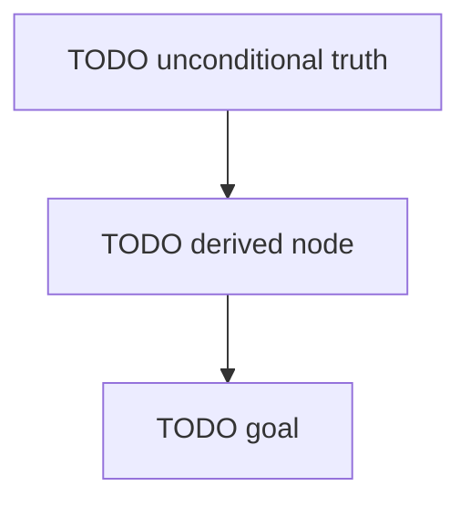

# Dependency map — {{TITLE}}

Roots are unconditional truths; arrows point from a node to what is built on it; the goal is the sink.

## Nodes

| id | kind | statement (one line) | depends on | mastery evidence |
|---|---|---|---|---|
| TODO | truth | | – | e.g. predict-output card + task 01 |

Node status is computed by `tools/learn progress`. Don't track it here.
