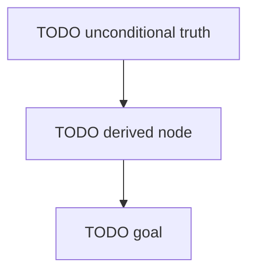

# Dependency map — {{TITLE}}

Roots are unconditional truths; arrows point from a node to what is built on it; the goal is the sink.

## Nodes

| id | kind | statement (one line) | depends on | status |
|---|---|---|---|---|
| TODO | truth | | – | new |

Status values: new · introduced · checked · retained · owned (`tools/learn progress` computes the evidence).
